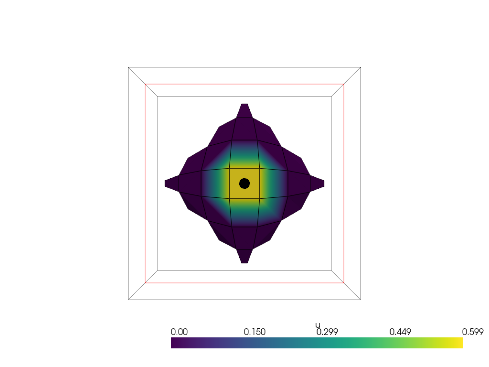

# Hexahedral brain mesh example

In this example, we will demonstrate how to create a hexahedral brain mesh using [automesh](https://autotwin.github.io/automesh/) from a [standard brain template](https://nist.mni.mcgill.ca/icbm-152-extended-nonlinear-atlases-2020/).


## Install 

First make sure to install [pixi](https://pixi.dev/) and the required dependencies.
In a terminal, run:

```bash
curl -fsSL https://pixi.sh/install.sh | sh
```

Then, install the dependencies specified in `pixi.toml`:

```bash
pixi run --environment dev install
```
This will install both the cargo package [automesh](https://autotwin.github.io/automesh/) and the required python packages.

The `automesh` package provides a command-line interface for generating and manipulating hexahedral meshes.
In order to use the mesh in FEniCS we will generate the mesh in Exodus format and then convert it to XDMF format using the `mesh-convert` from https://github.com/jorgensd/mesh_converter.


## Unit Ball Hexahedral Mesh example

Create the unit ball hexahedral mesh with

```bash
pixi run ballmesh
```

This will perform the following steps:

```bash
pixi run python3 create_unit_ball_hex_mesh.py
pixi run automesh mesh hex -r 0 -i unit_ball_hexahedral.npy -o unit_ball.exo
pixi run automesh smooth hex -n 100 -i unit_ball.exo -o unit_ball_smooth.exo
pixi run mesh-converter -i unit_ball_smooth.exo -o unit_ball_smooth.xdmf
```

Now you try the `poisson_ball.py` script to solve the Poisson equation on the unit ball hexahedral mesh with 
```bash
pixi run python3 poisson_ball.py
```



## Brain Hexahedral Mesh example

Create the brain hexahedral mesh with

```bash
pixi run brainmesh
```

This will perform the following steps:

```bash
pixi run python3 create_brain_hexmesh.py
pixi run automesh mesh hex -r 0 -i brain_hexahedral.npy -o brain.exo
pixi run automesh smooth hex -n 100 -i brain.exo -o brain_smooth.exo
pixi run mesh-converter -i brain_smooth.exo -o brain_smooth.xdmf
```

Now you try the `poisson_brain.py` script to solve the Poisson equation on the brain hexahedral mesh with 
```bash
pixi run python3 poisson_brain.py
```


# LICENSE
MIT License

